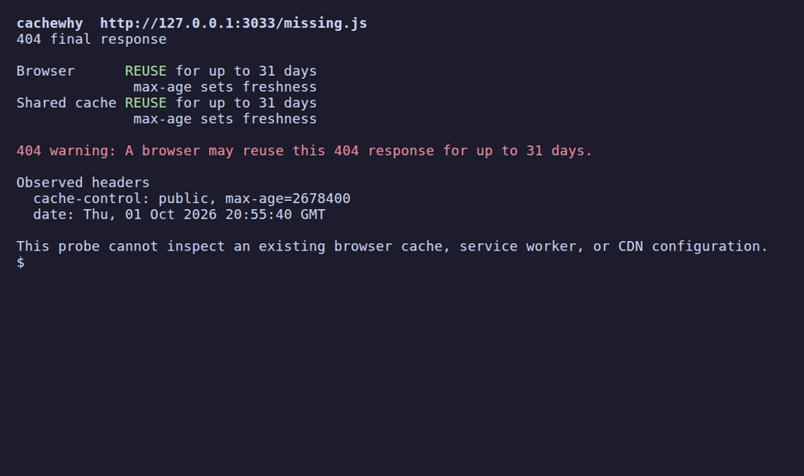

# cachewhy

**See whether an HTTP response can be reused by a browser or shared cache, and which header made that happen.**



Run it without installing a global package:

```sh
npx --yes github:Arthur031221/cachewhy https://example.com
```

Or install it in one command with `npm install -g github:Arthur031221/cachewhy`.

The local demo makes the result easy to reproduce:

```sh
git clone https://github.com/Arthur031221/cachewhy.git
cd cachewhy && npm ci
node demo/server.js
node bin/cachewhy.js http://127.0.0.1:3033/missing.js
node bin/cachewhy.js 'http://127.0.0.1:3033/missing.js?fixed=1'
```

Run the server in one terminal and the last two commands in another. The first response is a `404` with `Cache-Control: public, max-age=2678400`. A browser may reuse that response for up to 31 days. The second response uses `no-store`, so a cache must not store that **new** response. Changing a server header does not clear a response already held in a browser cache.

```text
404 final response

Browser      REUSE for up to 31 days
              max-age sets freshness
Shared cache REUSE for up to 31 days
              max-age sets freshness

404 warning: A browser may reuse this 404 response for up to 31 days.
```

## What it checks

`cachewhy` sends a GET to the URL and cancels the response body after reading its headers. It follows up to five HTTP redirects and reports each redirect separately from the final response. It uses [http-cache-semantics](https://github.com/kornelski/http-cache-semantics) for storage and freshness lifetime calculations, then accounts for the response `Age`, `Date`, and request delay. The two rows model a private browser cache and a shared HTTP cache. `--json` prints the same observations for scripts; `--timeout 2500` sets a 2.5 second request deadline.

`no-store` prevents storage of a new response. `no-cache` permits storage but requires validation before reuse. `s-maxage` sets freshness for a shared cache. `ETag` and `Last-Modified` can help validate a stale response. For qualified directives such as `private="Set-Cookie"`, the report says the result depends on cache support.

This is a header diagnosis for the response the probe received. It cannot inspect an existing browser cache, service worker, a CDN rule, cache keys, or a user's request headers. A CDN might serve the probe from its own cache. Headerless `404` responses can receive a heuristic lifetime, so the tool reports that case as uncertain. A GET can still trigger server work.

## Development

Requires Node 20 or newer. Run `npm ci` and `npm test`. The fixture server accepts `CACHEWHY_DEMO_PORT` for a different local port. See [CONTRIBUTING.md](CONTRIBUTING.md) for changes and tests.

MIT licensed.
